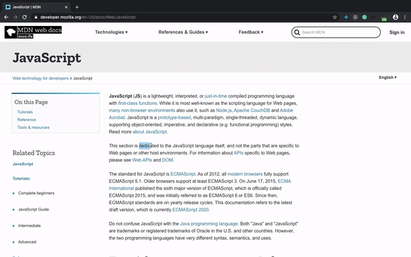

# Dictionare
A chrome extention that allows you to search meaning, synonyms and antonyms of a word on the go. 

Often while reading documents on the web, we encounter words we don't understand(specially if english is not your first language). No need to change the tab and manually google the word or try to guess the meaning from context of document. Just **select** the word and BOOM!!. You can get everything meaning, synonyms, antonyms etc at that place only. The extension by default searches for the first word in case you select more than one word. 

You can also easily turn off the extension in case you want to copy paste some text from the document. Just click on  the icon next to search bar and choose turn off or press "Cntl / Command + Shift + I". 

## To run locally 
1. Create a local copy of the repository.
   
   ``` git clone https://github.com/NKwatra/Dictionare.git```

2. Get your own copy of API key from [Merriam Webster](https://dictionaryapi.com/products/api-collegiate-thesaurus).
3. Create a file to store API key in the content directory.
   
    ``` touch content/key.js ```

4. Add below line to content/key.js

    ``` const userKey = <your-api-key> ```

5. Open [Chrome Extensions](chrome://extensions) and turn on developer mode(switch in upper right corner). Click on Load Unpacked and choose directory where you cloned the repository.

### Shorcut commands :
* To turn extension on press **Cntl /  Command + I** .
* To turn extension off press **Cntl / Command + Shift + I** .

### Demo 
